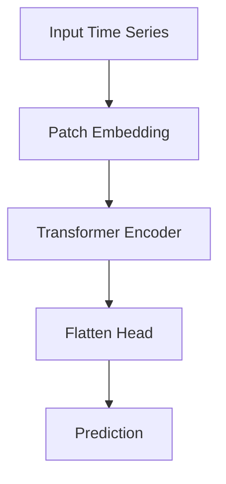

# 0507 Paper Reader Agent — 待实现功能

## 1. 流式输出（Streaming）

**优先级**：高  
**改动量**：小  

**问题**：当前等模型生成完毕才一次性显示，长回答时感觉卡死。

**方案**：
- `client.chat.completions.create()` 加 `stream=True`
- 逐 token 打印到终端
- tool_calls 的流式需要额外拼接处理

**涉及文件**：`agent.py` 的 `run_agent()` 函数

---

## 2. 对话历史持久化

**优先级**：高  
**改动量**：中  

**问题**：退出程序后对话丢失，无法继续之前的讨论。

**方案**：
- 每轮对话自动保存 conversation 到 `output/sessions/session_{id}.json`
- 启动时提供选项：`resume` 恢复上次会话 或 `new` 开始新会话
- 加 `/save` 和 `/load` 命令手动管理

**涉及文件**：`agent.py` 的 `main()` 函数，新增会话存储逻辑

---

## 3. 论文知识库积累（Learning Loop）

**优先级**：高  
**改动量**：中  

**问题**：读过的论文没有形成记忆，Agent 不记得之前分析过什么。

**方案**：
- 新建 `knowledge/papers.json`，存储结构化论文索引：
  ```json
  {
    "arxiv_id": "2310.06625",
    "title": "PatchTST",
    "category": "Transformer-based",
    "innovation": "将时间序列分patch输入Transformer",
    "datasets": ["ETTh1", "Weather"],
    "has_code": true,
    "repo_url": "https://github.com/..."
  }
  ```
- 每次读完论文后自动追加索引
- 对话开始时将已有论文列表注入 system prompt
- Agent 可以跨会话对比论文

**涉及文件**：`tools.py` 新增 `save_paper_index` 工具，`agent.py` 加载知识库到 prompt

---

## 4. Git Clone 工具

**优先级**：中  
**改动量**：小  

**问题**：搜索到代码仓库后无法自动下载分析。

**方案**：
- 新增 `git_clone` 工具，克隆到 `output/repos/{repo_name}/`
- 限制克隆深度 `--depth 1` 节省空间
- 配合 `read_file` 和 `list_files` 分析模型源码

**涉及文件**：`tools.py` 新增工具定义和 handler

---

## 5. 流程图生成（Mermaid）

**优先级**：中  
**改动量**：小  

**问题**：无法可视化模型架构和论文流程。

**方案**：
- 新增 `generate_diagram` 工具
- Agent 用 Mermaid 语法描述流程图
- 保存为 `.md` 文件（可在 VSCode/GitHub 中预览）
- 可选：调用 mermaid-cli 渲染为 PNG

**示例输出**：


**涉及文件**：`tools.py` 新增工具，`prompts/system.md` 加 Mermaid 语法指引

---

## 6.（可选）多论文对比分析

**优先级**：低  
**改动量**：中  

**问题**：读了多篇论文后缺乏横向对比能力。

**方案**：
- 基于论文知识库（功能3），新增 `/compare` 命令
- 自动生成对比表格（方法、数据集、指标、创新点）
- 输出 Markdown 表格保存到 output/

---

## 7. Skill：论文对比分析（compare_papers）

**优先级**：中  
**改动量**：中  
**类型**：Skill（多 tool 编排的预设工作流）

**问题**：对比两篇论文时，Agent 需要用户反复引导才能完成完整对比，缺少一套自动化的标准流程。

**Tool vs Skill 的区别**：Tool 是单个原子操作（如 `fetch_arxiv`），Skill 是多个 Tool 组合成的完整工作流，一句话触发，自动跑完。

**方案**：
- 用户说"对比 PatchTST 和 iTransformer"，Agent 自动执行完整流程：
  ```
  query_paper_index → 取出两篇论文信息
    → fetch_arxiv（如果没读过）→ 分析
    → 生成对比表格（方法、数据集、指标、创新点）
    → generate_diagram 画对比架构图
    → write_file 保存对比报告
  ```
- 实现方式：在 system prompt 中定义 `/compare` 指令的行为规则，或新建 `skills/compare_papers.py` 作为多步编排逻辑

**涉及文件**：`prompts/system.md` 新增行为规则，或新建 `skills/` 目录

---

## 8. Skill：文献综述（literature_survey）

**优先级**：中  
**改动量**：大  
**类型**：Skill（多 tool 编排的预设工作流）

**问题**：想调研某个方向的进展时，需要手动逐篇搜索和阅读，缺少自动化的综述生成能力。

**方案**：
- 用户说"帮我调研 2024 年时间序列 Foundation Model 的进展"，Agent 自动执行：
  ```
  web_search 搜论文列表
    → 逐篇 fetch_arxiv + 分析
    → save_paper_index 存入知识库
    → 横向对比 + 趋势总结
    → write_file 输出综述报告
  ```
- 输出结构化综述报告：研究背景、主要方法分类、代表论文对比表、发展趋势、开放问题

**涉及文件**：`prompts/system.md` 或新建 `skills/literature_survey.py`

---

## 9. MCP：Semantic Scholar 学术搜索

**优先级**：高  
**改动量**：中  
**类型**：MCP（外部服务接入）

**问题**：当前找论文靠 `web_search`，结果质量不稳定，混杂博客、新闻等非学术内容。

**什么是 MCP**：Model Context Protocol，一个标准协议，让 Agent 以统一方式连接外部数据源。和 Tool 的区别是：Tool 是自己写的本地函数，MCP 是接入外部服务的标准化接口。

**方案**：
- 接入 Semantic Scholar API（免费，无需 API Key 即可使用基础功能）
- 提供的能力：
  - 精确的论文搜索（标题、摘要、引用数、年份）
  - 引用关系图（这篇论文引用了谁、被谁引用）
  - 相关论文推荐
- 实现：新建 MCP server 封装 Semantic Scholar API，或简化为一个 tool 直接调用其 REST API

**API 示例**：
```
GET https://api.semanticscholar.org/graph/v1/paper/search?query=PatchTST+time+series
```

**涉及文件**：新建 `tools/semantic_scholar.py` 或 `mcp/semantic_scholar_server.py`

---

## 10. MCP：向量数据库（ChromaDB）实现 RAG

**优先级**：中  
**改动量**：大  
**类型**：MCP（外部服务接入）

**问题**：当前知识库 `papers.json` 是全量注入 prompt + 关键词匹配，论文多了以后会遇到两个瓶颈：
1. 全量注入撑爆上下文窗口
2. 关键词匹配找不到语义相关的论文（如搜"注意力机制的替代方案"找不到 Mamba）

**方案**：
- 接入 ChromaDB（本地向量数据库，纯 Python，`pip install chromadb`）
- 论文摘要和笔记做 embedding 存入向量数据库
- 查询时语义搜索，只取最相关的几篇注入 prompt（这就是 RAG）
- 与当前 `papers.json` 方案对比：

  | | 当前方案（JSON） | RAG 方案（ChromaDB） |
  |---|---|---|
  | 搜索方式 | 关键词匹配 | 语义相似度 |
  | 注入方式 | 全量注入 prompt | 只注入 top-K 相关论文 |
  | 论文规模 | <100 篇 | 1000+ 篇 |
  | 额外依赖 | 无 | chromadb + embedding 模型 |

**涉及文件**：新建 `mcp/chroma_server.py` 或 `tools/vector_search.py`，修改 `agent.py` 的知识库注入逻辑

---

## 实现顺序建议

```
Day 1: ✅ 流式输出 + 对话历史持久化
Day 2: ✅ 论文知识库 + Git Clone
Day 3: ✅ 流程图生成 + 多论文对比
Day 4: 上下文压缩（对话变长后再实现）
Day 5: Semantic Scholar MCP + 论文对比 Skill
Day 6: 文献综述 Skill + 向量数据库 RAG
```
