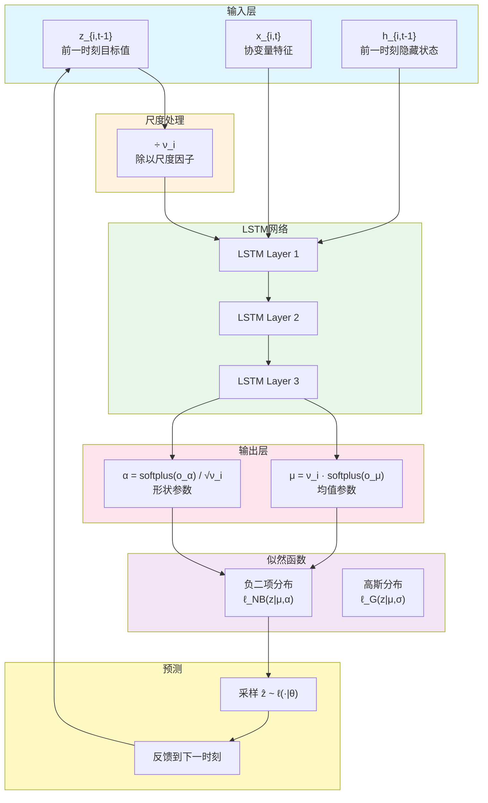

# DeepAR_Architecture

DeepAR模型架构图：展示自回归LSTM网络、尺度处理和负二项分布似然

```mermaid
graph TB
    subgraph Input["输入层"]
        Z["z_{i,t-1}<br/>前一时刻目标值"]
        X["x_{i,t}<br/>协变量特征"]
        H["h_{i,t-1}<br/>前一时刻隐藏状态"]
    end

    subgraph Scale["尺度处理"]
        DIV["÷ ν_i<br/>除以尺度因子"]
    end

    subgraph LSTM["LSTM网络"]
        L1["LSTM Layer 1"]
        L2["LSTM Layer 2"]
        L3["LSTM Layer 3"]
    end

    subgraph Output["输出层"]
        MU["μ = ν_i · softplus(o_μ)<br/>均值参数"]
        ALPHA["α = softplus(o_α) / √ν_i<br/>形状参数"]
    end

    subgraph Likelihood["似然函数"]
        NB["负二项分布<br/>ℓ_NB(z|μ,α)"]
        GAUSS["高斯分布<br/>ℓ_G(z|μ,σ)"]
    end

    subgraph Prediction["预测"]
        SAMPLE["采样 ẑ ~ ℓ(·|θ)"]
        LOOP["反馈到下一时刻"]
    end

    Z --> DIV
    DIV --> L1
    X --> L1
    H --> L1
    L1 --> L2
    L2 --> L3
    L3 --> MU
    L3 --> ALPHA
    MU --> NB
    ALPHA --> NB
    NB --> SAMPLE
    SAMPLE --> LOOP
    LOOP --> Z

    style Input fill:#e1f5fe
    style Scale fill:#fff3e0
    style LSTM fill:#e8f5e9
    style Output fill:#fce4ec
    style Likelihood fill:#f3e5f5
    style Prediction fill:#fff9c4

```
