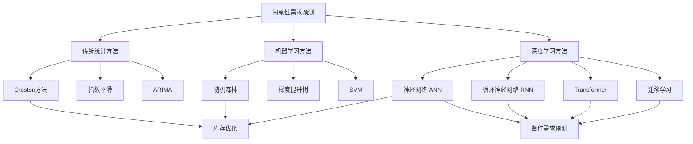

# 间歇性需求预测方法演进

间歇性需求预测方法的演进图，涵盖传统统计、机器学习和深度学习方法。

```mermaid
graph TD
    A[间歇性需求预测] --> B[传统统计方法]
    A --> C[机器学习方法]
    A --> D[深度学习方法]
    
    B --> B1[Croston方法]
    B --> B2[指数平滑]
    B --> B3[ARIMA]
    
    C --> C1[随机森林]
    C --> C2[梯度提升树]
    C --> C3[SVM]
    
    D --> D1[神经网络 ANN]
    D --> D2[循环神经网络 RNN]
    D --> D3[Transformer]
    D --> D4[迁移学习]
    
    D1 --> E[备件需求预测]
    D2 --> E
    D3 --> E
    D4 --> E
    
    B1 --> F[库存优化]
    C1 --> F
    D1 --> F
```
